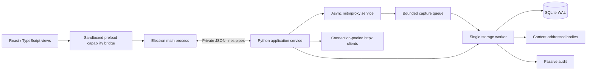

# Electron + Python architecture

Bidoytu 2 moves the desktop boundary out of Python. The renderer contains presentation and editor state; Python owns interception, replay, passive analysis, decoding, and workspace persistence. The legacy Qt adapter is optional and lives under `ui/`.



## Module ownership

| Location | Responsibility |
| --- | --- |
| `desktop/src/views/` | History, Intercept, Repeater, Intruder, Scope, Audit, Decoder, Settings |
| `desktop/src/hooks/useWorkspace.ts` | UI state, session restoration, event subscriptions, request sequencing |
| `desktop/src/components.tsx` | Shared editors, virtualized message display, buttons and state indicators |
| `desktop/src/types.ts` | Typed renderer data contracts |
| `desktop/electron/main.cjs` | Window lifecycle, IPC sender checks, sidecar supervision, CA save dialog |
| `desktop/electron/preload.cjs` | Narrow context-isolated renderer bridge |
| `desktop/electron/backend.cjs` | JSON framing, request correlation, timeouts, method allowlist, EOF shutdown |
| `src/bidoytu/backend/` | Headless use cases, stdio protocol, storage worker |
| `src/bidoytu/proxy/engine.py` | Async proxy lifecycle; no Qt imports |
| `src/bidoytu/proxy/capture_addon.py` | Existing request/response capture and wire edits |
| `src/bidoytu/storage/` | Existing compatible flow schema and body store |
| `src/bidoytu/ui/qt_proxy_engine.py` | Compatibility adapter for the optional Qt application |

## Process protocol

Electron launches Python with anonymous stdin/stdout pipes. No control HTTP/WebSocket listener is opened. Proxy traffic uses a separate loopback listener, normally `127.0.0.1:8080`.

Requests are UTF-8 JSON lines: `{"id":1,"method":"history.list","params":{"limit":100}}`.
Responses contain the same ID with `result` or `error.message`. Events have `event` and `data`; `ready` reports protocol version 1. Diagnostics go to stderr and cannot corrupt the protocol. `changed` notifications coalesce at 200 ms and trigger metadata refreshes. They contain no request/response body payloads.

The Electron allowlist and Python dispatch must both recognize a command. Certificate bytes use a main-process-only command and a native save dialog. Backend exceptions reject the specific operation. Process exit rejects outstanding calls and displays an offline state; restarting the application recreates the engine. Normal app exit closes stdin, drains persistence and closes the proxy. A 12-second supervisor deadline force-stops an unresponsive child.

## Concurrency and limits

- One asyncio loop owns mitmproxy and pooled HTTP clients. No Qt event loop is required.
- A dedicated executor thread owns the SQLite connection and filesystem work. Captures enqueue a shallow copy so body spilling cannot mutate a paused flow.
- The capture queue holds at most 512 updates and 64 MiB of queued body bytes. Overload drops capture updates, not forwarded network traffic, and increments a visible counter. This is explicit loss reporting, not a guarantee of lossless capture under overload.
- At most 100 paused flows are retained. Further intercepts are dropped with a visible error. Disabling interception releases waiting traffic.
- History uses a body-free SQL projection, descending IDs, and bounded pages (100 in the UI; maximum 250 over IPC). The UI mounts only visible rows with overscan.
- Bodies above 64 KiB spill to content-addressed files. Detail previews read at most 256 KiB per body. Messages display as inert text, never as HTML.
- Proxy and replay captures have a 32 MiB response/body limit. HTTP replay has eight concurrent request slots, a pooled connection limit of 16, and a 30-second network timeout.
- Intruder replaces the explicit `§payload§` marker, accepts up to 1,000 payloads and runs sequentially with a 100 ms interval. Cancellation interrupts the current request.
- IPC accepts at most 32 outstanding commands and 2 MiB per request. Repeater editors accept at most 1 MiB. Saved desktop sessions have a 1 MiB limit.

Python's advantage here is asynchronous I/O, connection reuse and process isolation. This implementation does not claim Python is inherently faster than other low-level networking runtimes.

## Security boundary

The renderer uses `sandbox: true`, `contextIsolation: true`, `nodeIntegration: false`, and web security. Main verifies the sender, main frame, and exact application URL before IPC. New windows, navigation away from the app, webviews, and permission requests are denied. Production CSP prohibits inline scripts and remote resources; the development-only Vite transform permits its inline refresh preamble.

TLS verification defaults to enabled for the Electron engine and Repeater. The Settings toggle affects replay and the next proxy start. Trusting the public CA is a separate user/browser operation. The export code reads only `mitmproxy-ca-cert.pem`, never the private CA file. There is no automatic certificate installation or browser launch.

Captured credentials, history and saved Repeater requests are local plaintext data. Filesystem access controls protect the workspace; at-rest encryption is not implemented. Keep workspaces in a protected user directory.

## Persistence and migration

The default desktop workspace is under Electron's `userData/workspaces/default`. `BIDOYTU_DATA_DIR` selects another data directory before launch. History uses the existing flow schema; Repeater tabs and network preferences use atomically replaced `desktop-session.json`; host scope uses the existing scope file. Session edits autosave after 350 ms of inactivity. Passive findings and Intruder results are session-local; the requests generated by Intruder remain in history.

Existing Qt workspace files are preserved. To work on an old dataset, close both apps, copy the complete old workspace (including body files), and point `BIDOYTU_DATA_DIR` at the copy. Do not run both applications against the same workspace. Qt's installation-wide CA is not imported automatically into the new desktop workspace, so certificate trust must be configured for the new CA.

The new desktop covers the core workflows listed above. Legacy-only features currently include Collaborator/Interactsh, automatic browser integration, workspace archive/password management, the advanced scope/path/regex editor, advanced filter grammar, multi-position Intruder attack modes, grouped Repeater sends, and active verification. These remain available through the optional Qt application. The new UI has one active workspace selected at process launch; it is not yet full feature parity with every Qt tool.

Raw HTTP editing is text-oriented and tolerant, not a byte-perfect protocol editor. httpx manages connection framing and content length. Pretty mode is display-only. Binary or truncated previews cannot be replayed through the send-to action; forwarding an unchanged interception preserves the original wire bytes.

## Verification

```powershell
python scripts/backend_test.py
npm test
npm run build
npm run test:e2e
python scripts/backend_benchmark.py
node desktop/tests/editor-performance.mjs
```

Backend tests use local origin fixtures to cover gzip capture, request/response edits, forward/drop, same-port restart, port conflicts, replay, body spilling, pagination, scope, passive audit, payload runs, decoding and the absence of Qt imports. Electron E2E uses the real sidecar and checks sandbox flags, replay, history, bookmarking, scope and decoding at 1480×940 and 1100×760.

Local Windows/Python 3.13 measurements from this rebuild: 10,000 stored rows with 40.96 MB of body data; 100-row metadata pages returned 32,928 bytes with 0.79 ms median / 1.04 ms p95 service latency across 40 samples. This excludes IPC, painting and network I/O. The 20,000-line editor fixture reduced mounted rows from 20,001 to 61 after virtualization. Re-run the scripts on target hardware; these are measurements, not SLAs.

Electron security references: [context isolation](https://www.electronjs.org/docs/latest/tutorial/context-isolation), [sandboxing](https://www.electronjs.org/docs/latest/tutorial/sandbox).
